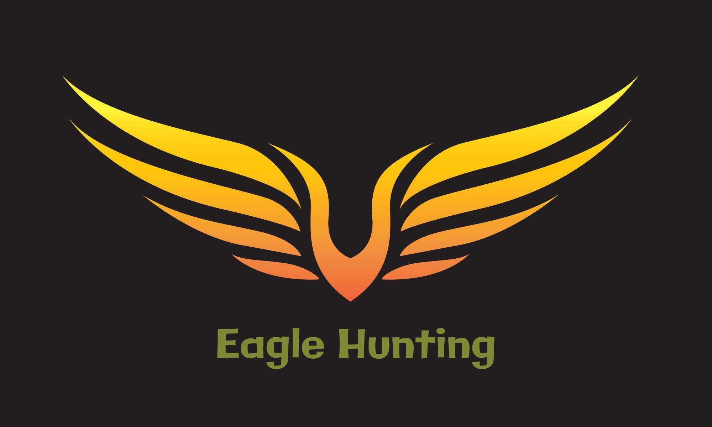
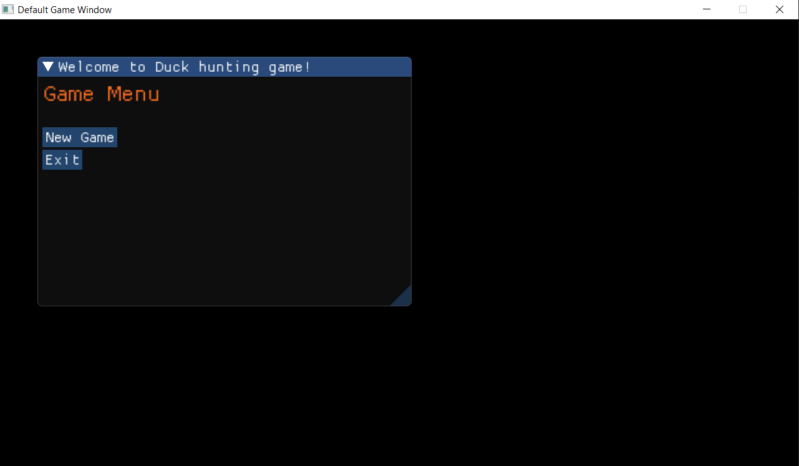
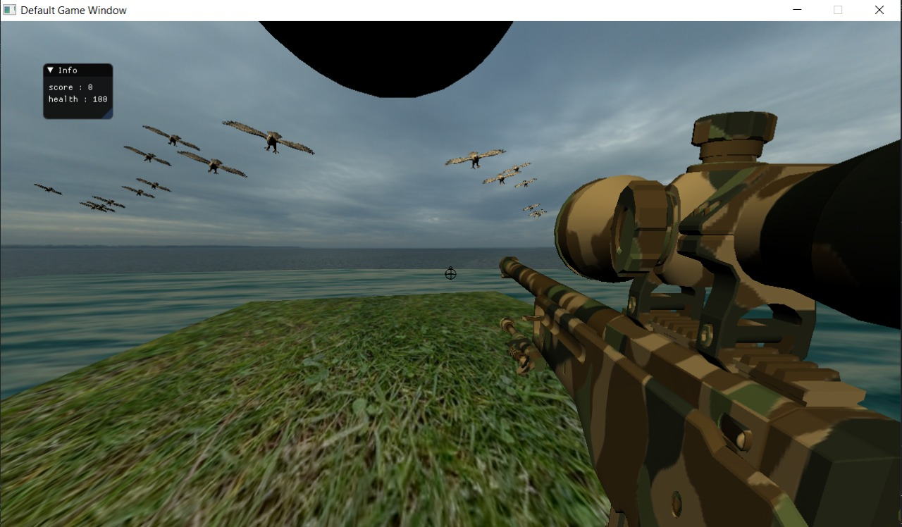
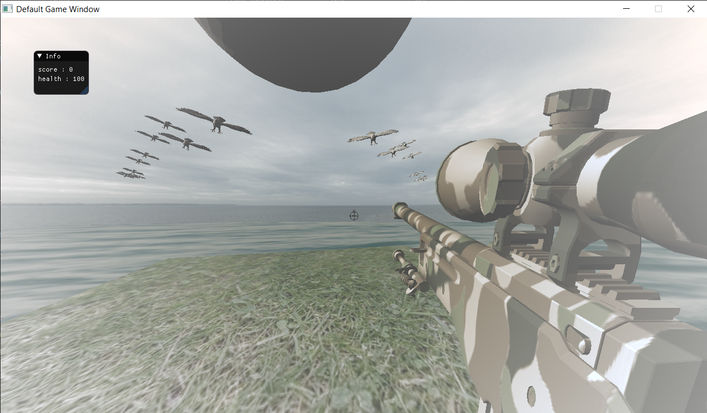

# Eagle hunting game
<p align="center">
  <a href="" rel="noopener">
 </a>
</p>
<p align="center">
    <br> 
</p>
<div align="center">
  
[](https://github.com/Eagle-Hunting-Game/contributors)
[](https://github.com/gaserashraf/Eagle-Hunting-Game/issues)
[](https://github.com/gaserashraf/Eagle-Hunting-Game/network)
[](https://github.com/gaserashraf/Eagle-Hunting-Game/stargazers)
[](https://github.com/gaserashraf/Eagle-Hunting-Game/blob/master/LICENSE)

</div>


## 📝 Table of Contents

- [About](#about)
- [Get Started](#Install)
- [Technology](#tech)
- [Screenshots](#Screenshots)

## 📙 About <a name = "about"></a>
Eagle Hunting is a 3d game where you have a simple goal : kill the eagles before they kill you !

## 🏁 Get Started <a name = "Install"></a>
1. **Clone the repository**
```
git clone https://github.com/gaserashraf/Eagle-Hunting-Game.git
```
2. **Install Visual Studio Code**


3. **Open the folder in Visual Studio Code**


4. **Build the project**


4. **Open a terminal (Terminal > New Terminal)**


5. **Run this Command**
```
.\bin\GAME_APPLICATION.exe -c="config\test_app.jsonc"
```
## 💻 Built Using <a name = "tech"></a>
- [C++]()
- [OpenGL](https://www.opengl.org/)
## 🎮How to play<a name = "play"></a>
- Use *A* to move left.
- Use *D* to move right.
- Use *W* to move front.
- Use *S* to move back.
- Use *ESC* to pause the game.

## 🎥 Demo<a name = "demo"></a>

[Demo video](https://drive.google.com/drive/u/0/folders/1x10qtq6kFqJL2fCT-Ny88-ja2iHGbB2C)

## 📷 Screenshots 

<div name="Screenshots" align="center">
   </a>
   <hr>
    </a>
    <hr>
    Fog effect
   </a>
   <hr>
</div>

### ✨ Contributors
<table>
  <tr>
    <td align="center"><a href="https://github.com/gaserashraf"><br /><sub><b>Gaser Ashraf</b></sub></a><br /></td>
     <td align="center"><a href="https://github.com/Ahmed-Emad10"><br /><sub><b>Ahmed Emad</b></sub></a><br /></td>
     <td align="center"><a href="https://github.com/Ahmedmma72"><br /><sub><b>Ahmed Mahmoud</b></sub></a><br /></td>
     <td align="center"><a href="https://github.com/Thebrownboy"><br /><sub><b>Abdalla Mahmoud</b></sub></a><br /></td>
  </tr>
 </table>


